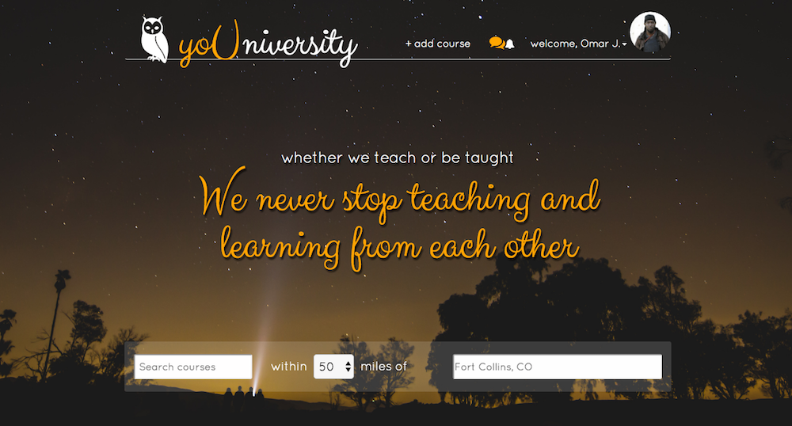

# yoUniversity

Teaching and learning is a community endeavor, and we all have something to teach and learn. yoUniversity is an application that connects those who have some skill or expertise to share with those who are willing to pay for it. Users can create classes for others to take--and make a buck or two in the process--or they can simply sign up for others' classes and enjoy learning.

Node.js, ExpressJS, ReactJS and PostgreSQL were used to build yoUniversity. Check out the server-side code here: [yoUniversity Backend] (https://github.com/you-Niversity/you-Niversity-backend)
